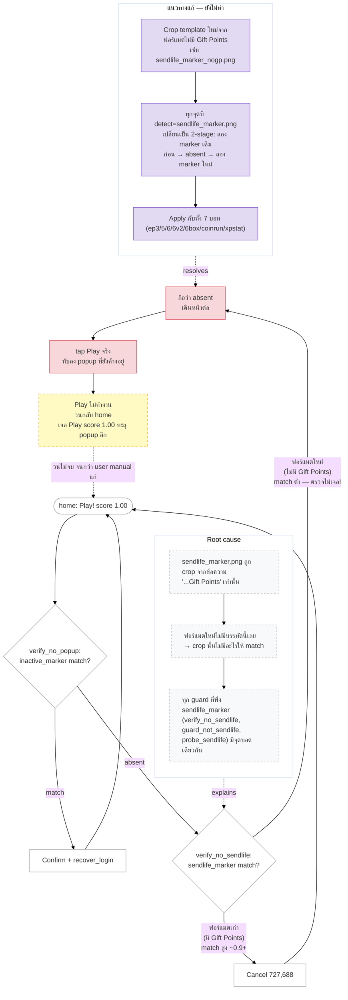

# Send-Life ค้างหน้า Play — Debug Logic Flow

## สถานะ: ✅ แก้แล้ว + live-verified

เพื่อนเจอบอทค้างที่ popup "Send &lt;name&gt; a free Life?" บ่อยครั้ง แม้ guard chain (`verify_no_sendlife` / `guard_not_sendlife` / `probe_sendlife`) มีอยู่แล้วในทุกบอท. หา root cause พบว่าเกมมี **popup 2 ฟอร์แมต** ที่หน้าตาต่างกัน แต่ template ตรวจจับ (`sendlife_marker.png`) ถูก crop จากฟอร์แมตเดียว.

**Fix ที่ implement จริง:** crop template ใหม่จากคำว่า **"a free Life?"** (name-agnostic, ไม่รวมชื่อเพื่อน) แทนที่ `sendlife_marker.png` เดิมทั้งไฟล์ — เพราะ text นี้ปรากฏใน**ทั้ง 2 ฟอร์แมต** (เก่ามี "(+3 Gift Points)" ต่อท้าย, ใหม่ไม่มี) ครอบคลุมทั้งคู่ด้วย template เดียว ไม่ต้องเพิ่ม 2-stage detect ตามแผนเดิม. ทุก config (7 บอท) ใช้ชื่อไฟล์เดิม จึงไม่ต้องแก้ JSON เลย.

Live-test บนภาพจริง ("Send UwU a free Life?"): old marker score 0.465 (ไม่ match) → new marker score 1.000 (match) → `verify_no_sendlife` จับได้ → Cancel (724,687) → กลับ home → tap Play ปกติ.

## ฟอร์แมตที่เจอจริง

| ฟอร์แมต | ข้อความ | Gift Points line | `sendlife_marker` match |
|---|---|---|---|
| เก่า (ตอน crop template) | "Send &lt;name&gt; a free Life? (+3 Gift Points)" | ✅ มี | ✅ match สูง (crop มาจากตรงนี้) |
| ใหม่ (ที่เพื่อนเจอ) | "Send NUTJ!UKNOW a free Life?" | ❌ ไม่มี | ⚠️ อาจ match ต่ำ/ไม่ match — crop ไปจับคำว่า "Gift Point" ที่ฟอร์แมตนี้ไม่มี |

Config มี template สำรอง (`sendlife_confirm_gp_marker.png` / `sendlife_confirm_marker.png`) แต่ใช้เฉพาะที่ **confirm dialog ของบอท sendlife.json** (บอทส่งชีวิตอัตโนมัติ) เท่านั้น — **บอท box-farm ทั้ง 7 ตัว (ep3/5/6/6v2/6box/coinrun/xpstat) ยังตรวจจับ popup ตัวนี้ด้วย `sendlife_marker` ตัวเดียว ไม่มี fallback**.

## Logic Flow (Mermaid)

## สรุปสถานะ

- ✅ เจอ root cause + แก้แล้ว + live-verified
- Fix: `templates/cookierun/sendlife_marker.png` เปลี่ยน crop เป็น "a free Life?" (format-agnostic) แทนของเดิมที่ crop "Gift Points" (มีแค่ฟอร์แมตเดียว)
- ไฟล์เก่าเก็บ backup ไว้ที่ `sendlife_marker_gp_only.png.bak`
- ไม่ต้องแก้ config JSON เลย — ทุกบอทอ้างชื่อไฟล์เดิม `sendlife_marker.png`
